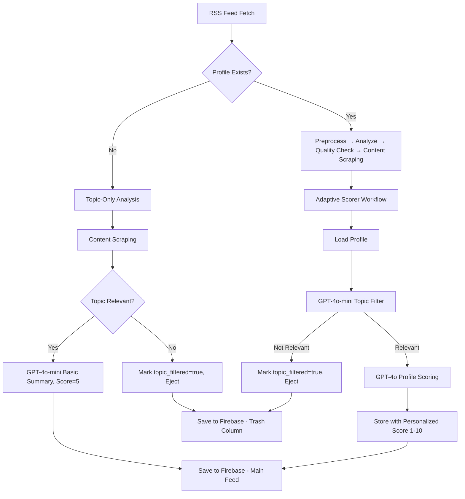

# Article Processing Pipeline

## Overview

Adjutant features a sophisticated multi-stage article processing pipeline built on LangGraph workflows and OpenAI integration. The system intelligently routes articles through different processing paths based on user profile availability, providing cost-optimized AI analysis while maintaining high-quality content scoring.

## Pipeline Architecture

The article processing pipeline consists of two main processing paths:

1. **Topic-Only Analysis** - Cost-optimized processing for users without profiles
2. **Adaptive Scorer Workflow** - Profile-based personalized scoring (uses traditional analysis for content scraping)
3. **Learner Workflow** - User profile generation and evolution

## Processing Path 1: Topic-Only Analysis (No Profile)

### Purpose
Cost-optimized article processing for users without profiles. Uses only GPT-4o-mini for significant cost savings (73% reduction vs. full analysis).

**Function**: `analyzeArticleWithTopicOnly()` in `src/workflow.ts`  
**Trigger**: When `checkProfileExists()` returns false

### Processing Steps

1. **Content Scraping**
   - Attempts to scrape full article content from webpage
   - Falls back to RSS content if scraping fails
   - Handles blocked domains and scraping errors

2. **Topic Relevance Check** 
   - Uses GPT-4o-mini for topic filtering
   - Simple yes/no prompt about topic relevance
   - **Decision Point**: 
     - **Not Relevant**: Article marked as `topic_filtered: true` and ejected
     - **Relevant**: Continue to summary generation

3. **Basic Summary Generation** (if topic-relevant)
   - Uses GPT-4o-mini to generate 2-3 sentence summary
   - Assigns default `ai_score: 5` 
   - Category set to "Topic-relevant"

### Cost Optimization
- **Single Model**: Only GPT-4o-mini (no GPT-4o usage)
- **Early Ejection**: Topic-filtered articles stop processing immediately
- **Simple Analysis**: Basic summary vs. complex analysis

### Output States
- **Topic Filtered**: `topic_filtered: true, ai_score: null`
- **Topic Relevant**: `topic_filtered: false, ai_score: 5, basic summary`

## Workflow 1: Adaptive Scorer Workflow

### Purpose
Provides personalized article scoring based on user preferences when a profile exists. Optimizes costs through intelligent routing and model selection.

### Nodes
1. **Load Profile** (`loadProfileNode`)
   - Queries Firebase for user profile (`profiles/user-profile`)
   - Loads user likes/dislikes preferences
   - Routes to appropriate scoring path

2. **Topic Filter** (`topicFilterNode`)
   - Uses cost-optimized GPT-4o-mini for topic relevance
   - Filters articles based on user's topic description
   - Marks irrelevant articles as `topic_filtered: true`

3. **Profile Scoring** (`profileScoringNode`)
   - Uses GPT-4o for sophisticated preference analysis
   - Scores articles 1-10 based on user profile
   - Generates personalized summaries

### Flow Control
```
START → Load Profile → Topic Filter → Profile Scoring → END
            ↓             ↓              ↓
        [No Profile]  [Not Relevant] [Scoring Complete]
            ↓             ↓              ↓
           END           END           END
```

### Cost Optimization Strategy
- **No Profile**: Articles remain unscored (null ai_score)
- **Topic Filtering**: GPT-4o-mini for initial relevance check (73% cost savings)
- **Profile Scoring**: GPT-4o only for relevant articles requiring detailed analysis
- **Caching**: Previously filtered articles skip re-processing

### State Management
```typescript
interface AdaptiveScorerState {
  article: ArticleData;
  topicDescription: string;
  
  userProfile?: UserProfile;
  topicRelevant?: boolean;
  scoredArticle?: ArticleData;
  errorCount: number;
  
  lastError?: string;
}
```

## Workflow 2: Learner Workflow

### Purpose
Generates and evolves user profiles based on article rating feedback to enable personalized scoring.

### Nodes
1. **Collect Feedback** (`collectFeedbackNode`)
   - Queries Firebase for user-rated articles
   - Filters articles where `relevant != null`
   - Provides training data for profile generation

2. **Validate Threshold** (`validateThresholdNode`)
   - Ensures minimum 2 relevant + 2 not-relevant ratings
   - Prevents profile generation with insufficient data
   - Returns validation status

3. **Load Existing Profile** (`loadExistingProfileNode`)
   - Loads current profile for evolution (if exists)
   - Supports both new profile creation and profile updates
   - Maintains profile history

4. **Generate Profile** (`generateProfileNode`)
   - Uses GPT-4o to analyze user preferences
   - Creates/evolves profile with max 15 likes/dislikes
   - Generates changelog explaining profile changes

5. **Save Profile** (`saveProfileNode`)
   - Saves profile to Firebase (`profiles/user-profile`)
   - Updates timestamps and metadata
   - Enables adaptive scoring for future articles

### Flow Control
```
START → Collect Feedback → Validate Threshold → Load Existing → Generate → Save → END
                              ↓                    ↓            ↓        ↓
                         [Insufficient Data]  [Profile Loaded] [Generated] [Saved]
                              ↓                    ↓            ↓        ↓
                             END                  ↓            ↓       END
                                                 ↓            ↓
                                            [Continue]   [Continue]
```

### State Management
```typescript
interface LearnerState {
  ratedArticles: ArticleData[];
  existingProfile?: UserProfile;
  generatedProfile?: UserProfile;
  errorCount: number;
  validationPassed: boolean;
}
```

## Pipeline Integration

### Main Workflow Orchestration (`src/workflow.ts`)

The main workflow orchestrator coordinates the processing paths:

1. **RSS Feed Processing**
   - Fetches from 5 configured sources
   - Applies 90-day age filtering
   - Limits to 10 articles per feed

2. **Intelligent Routing**
   ```typescript
   // Check if user has a profile
   const hasProfile = await checkProfileExists(userConfig);
   
   if (hasProfile) {
     // Route to Adaptive Scorer Workflow
     // (First runs traditional analysis workflow for content scraping)
     result = await runAdaptiveScorerWorkflow(article, topicDescription, userConfig);
   } else {
     // Route to Topic-Only Analysis (cost-optimized)
     result = await analyzeArticleWithTopicOnly(article, source, userConfig);
   }
   ```

3. **Database Storage**
   - Creates unique article IDs using SHA-256 hash of URL
   - Stores complete article data in Firebase Firestore
   - Maintains real-time listeners for UI updates

### Processing Flow



## Error Handling & Retry Logic

### Retry Mechanisms
- **Analysis Workflow**: Up to 3 retries for AI analysis failures
- **Adaptive Scorer**: 2 retries for OpenAI API failures with exponential backoff
- **Content Scraping**: Single attempt with graceful fallback to RSS content

### Error Recovery
- **Firebase Conflicts**: Unique app names prevent instance conflicts
- **API Rate Limits**: Built-in retry logic with delays
- **Content Scraping Failures**: Fallback to RSS excerpts
- **Profile Loading Errors**: Graceful degradation to unscored articles

## Performance Optimizations

### Cost Efficiency
- **Model Selection**: GPT-4o-mini for topic filtering (73% cost reduction)
- **Content Truncation**: 4000 character limit for cost optimization
- **Smart Caching**: Skip re-processing of filtered articles
- **Batch Processing**: Process articles in parallel where possible

### Memory Management
- **Firebase Apps**: Unique timestamped app names prevent conflicts
- **State Cleanup**: Proper workflow state management
- **Connection Pooling**: Efficient database connection reuse

### Processing Speed
- **Parallel Processing**: Multiple articles processed simultaneously
- **Content Optimization**: Truncated content for faster AI processing
- **Database Indexing**: Optimized Firestore queries

## Configuration & Initialization

### Workflow Initialization
```typescript
// Initialize Analysis Workflow
const analysisWorkflow = new AnalysisWorkflow();

// Initialize Adaptive Scorer
initializeAdaptiveScorerWorkflow(userConfig);
const workflow = createAdaptiveScorerWorkflow();

// Initialize Learner Workflow
initializeLearnerWorkflow(userConfig);
const learnerWorkflow = createLearnerWorkflow();
```

### Required Configuration
- **OpenAI API Key**: For GPT-4o and GPT-4o-mini models
- **Firebase Config**: 6-field configuration for Firestore
- **Topic Description**: User-defined topic for relevance filtering
- **RSS Sources**: Configured news sources for content fetching

## Data Flow & Storage

### Article Data Model
```typescript
interface ArticleData {
  url: string;
  title: string;
  author: string;
  rss_excerpt: string;
  full_content_text: string;
  source_name: string;
  published_at: Date;
  fetched_at: Date;
  
  // AI Analysis
  ai_summary: string;
  ai_score: number | null;
  ai_category: string;
  
  // User Interaction
  relevant: boolean | null;
  rated_at?: Date;
  is_read: boolean;
  
  // Content Processing
  content_source: 'rss' | 'scraped' | 'failed';
  scraping_status: 'pending' | 'success' | 'failed';
  content_length: number;
  
  // Topic Filtering
  topic_filtered?: boolean;
  topic_filtered_at?: Date;
}
```

### Profile Data Model
```typescript
interface UserProfile {
  likes: string[];           // Max 15 descriptive preferences
  dislikes: string[];        // Max 15 descriptive dislikes
  changelog: string;         // AI explanation of changes
  last_updated: Date;        // Profile update timestamp
  created_at: Date;          // Profile creation timestamp
}
```

## UI Integration

### Real-time Updates
- **Firebase Listeners**: Real-time article updates in UI
- **State Management**: Button states based on profile existence
- **Progress Indicators**: Loading states during processing

### Article Display Logic
- **Unrated Column**: Articles with `relevant == null` and `ai_score > 3`
- **Relevant Column**: Articles with `relevant == true`
- **Trash System**: Three-column categorization:
  - User Rejected: `relevant == false`
  - Low Score: `ai_score <= 3 && !topic_filtered`
  - Topic Filtered: `topic_filtered == true`

## Monitoring & Debugging

### Logging Strategy
- **Workflow Progress**: Detailed console logging for each node
- **Performance Metrics**: Processing time and cost tracking
- **Error Reporting**: Comprehensive error messages with context
- **State Transitions**: LangGraph state change logging

### Debug Tools
- **Workflow Status**: `getWorkflowStats()` for health checking
- **Profile Validation**: `checkProfileExists()` for profile state
- **Article Processing**: Individual article processing logs
- **Firebase Operations**: Database operation success/failure tracking

## Future Enhancements

### Planned Features
- **Multi-Profile Support**: Different profiles for different topics
- **Workflow Analytics**: Processing performance metrics
- **Custom Scoring Models**: User-configurable scoring algorithms
- **Batch Re-processing**: Bulk article re-scoring capabilities

### Scalability Considerations
- **Horizontal Scaling**: Multi-instance processing support
- **Queue Management**: Article processing queue for high volume
- **Caching Layer**: Redis integration for improved performance
- **Model Optimization**: Fine-tuned models for specific use cases

## Technical Dependencies

### Core Technologies
- **LangGraph**: Workflow orchestration and state management
- **OpenAI API**: GPT-4o and GPT-4o-mini for AI processing
- **Firebase Firestore**: Real-time database for article storage
- **RSS Parser**: Feed parsing and content extraction
- **JSDOM**: Web scraping and content extraction

### Node.js Packages
- `@langchain/langgraph`: Workflow framework
- `@langchain/openai`: OpenAI integration
- `firebase`: Firebase SDK
- `rss-parser`: RSS feed parsing
- `jsdom`: Web scraping capabilities

This pipeline provides a robust, scalable, and cost-effective solution for personalized news processing, combining the power of LangGraph workflows with intelligent AI model selection and comprehensive error handling. 